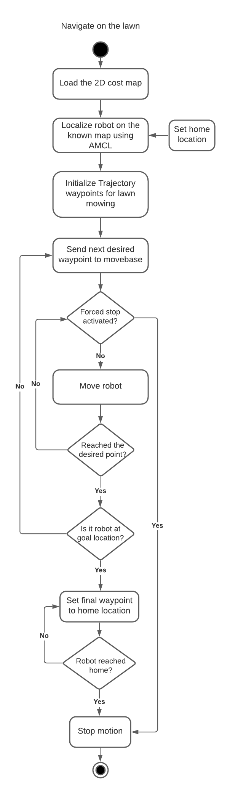
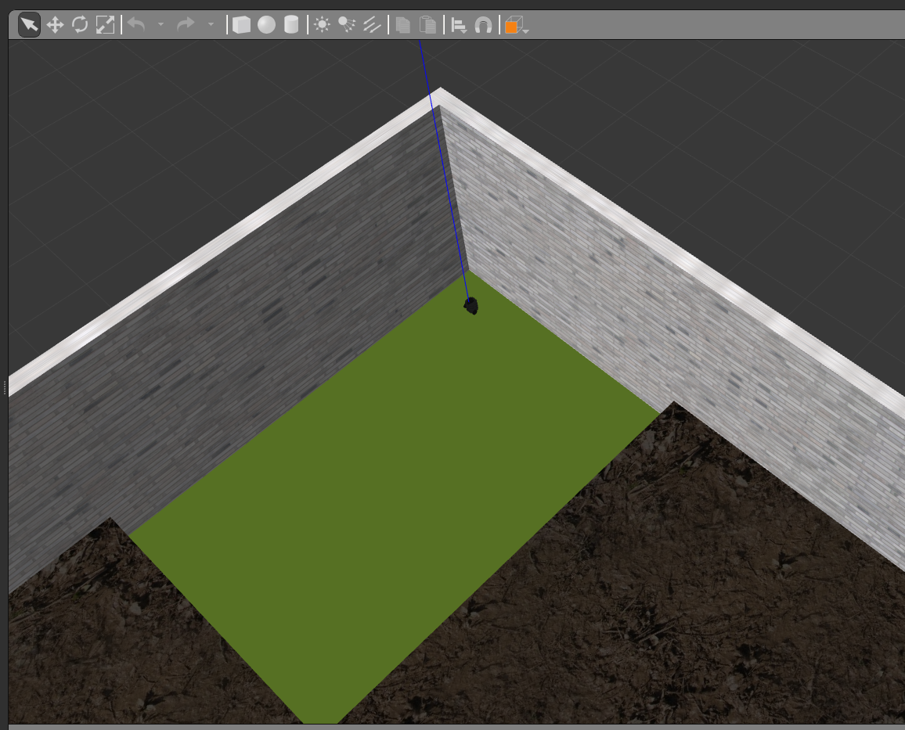
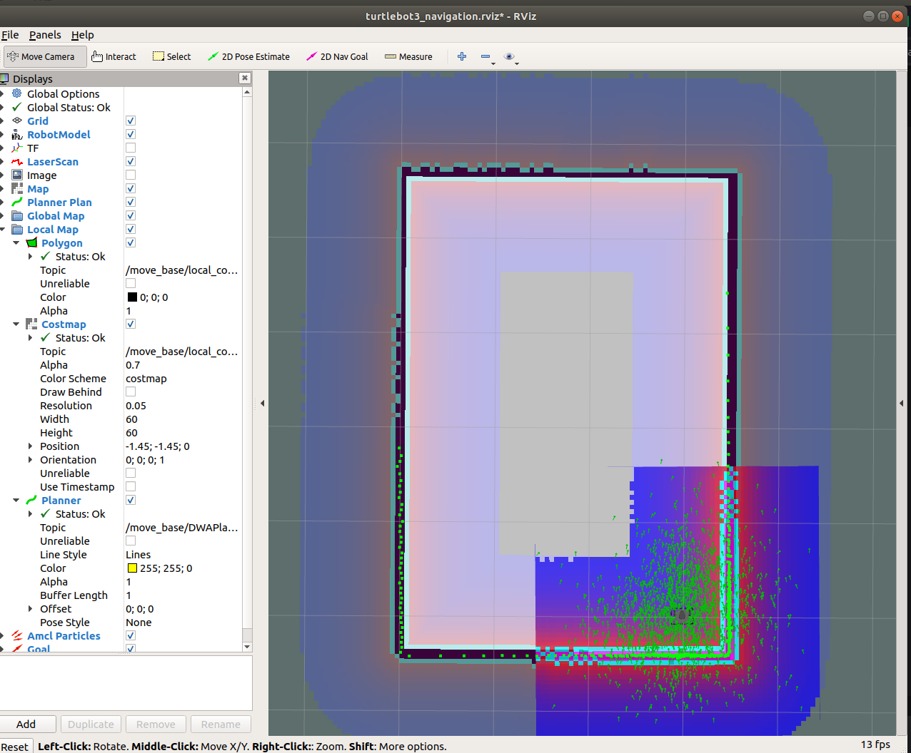

  
# Autonomous Lawn Mower - ALM

A ROS based robot for autonomous lawn mowing.

## Authors

 - [Arunava Basu](https://www.linkedin.com/in/abasu713/) 
 - [Aditi Ramadwar](https://www.linkedin.com/in/aditiramadwar/) 

## Introduction
With the sprawl of the urbanized communities, today's houses have large lawns that demand constant upkeep. Such a manual an repetitive task is not only laborious but also taxing and truly unnecessary. Robot are great at performing complex repetitive tasks autonomously, and as this this is a great problem that can be solved using autonomous systems.
We propose to implement a robust robotic system in Gazebo and ROS inspired by an autonomous lawn mower called “Automower” which is capable of mowing a desired lawn area, following a predefined pattern to cut the lawn and dynamically avoid obstacles. This product would serve a long term project for ACME's robotics division and would be an ideal way to utilize the recent capital infusion in the department. Assuming an environment map known beforehand, our robot uses the TurtleBot robot as its base platform as it follows its trajectory for mowing the lawn. 

Our system is built using C++ and will leverage the ROS Navigation stack for performing autonomous navigation.

## Project Collaterals
The Agile Iterative Process will be used for the development of this system consisting of two sprints.

The project proposal can be found [here](https://github.com/llDev-Rootll/Autonomous_Lawn_Mower/blob/master/assets/Autonomous_Lawn_Mower-Proposal.pdf).

The quad chart can be found [here](https://github.com/llDev-Rootll/Autonomous_Lawn_Mower/blob/master/assets/Quad_Chart.pdf).

The overall backlog table and the tables for each sprints can be found [here](https://docs.google.com/spreadsheets/d/1WAa7oFD4pA2sujA1pLWYuytpL0tj46f_C2mvmyDHtKc/edit#gid=1860513107).

The sprint planning notes can be found [here](https://docs.google.com/document/d/1wy9xlAPdjao29AV2lVo_EQJV9MCoEYegYT7aFkh7owY/edit).

## System Architecture 
The following shows the activity diagram for our proposed schema : 

*Fig 1 :  Activity Diagram*

The corresponding class diagram can be found [here](https://github.com/llDev-Rootll/Autonomous_Lawn_Mower/blob/master/UML/initial/Mower_Class_Diagram.pdf).
## Steps to install dependencies
Run the following commands to install the dependencies required:

Installing the ROS navigation stack:

    sudo apt-get install ros-melodic-navigation
Installing the turtlebot3 dependencies:

    sudo apt-get install ros-melodic-turtlebot3 ros-melodic-turtlebot3-msgs ros-melodic-turtlebot3-navigation ros-melodic-turtlebot3-simulations 
## Steps to install the ALM package

  Make a catkin workspace catkin_ws and run the following commands :
  

    cd <path_to_ws>/catkin_ws/src
    git clone https://github.com/llDev-Rootll/beginner_tutorials.git
    cd ../
    catkin_make
## Steps to run the simulation using the launch file
In a terminal run :

    source devel/setup.bash
    roslaunch alm spawn.launch 
This spawns the turtlebot3 simulation in the custom world environment on the green lawn.

*Fig 1 : Spawn the robot in the world*
In a terminal run the following to bring up the mowing routine node:

    source devel/setup.bash
    roslaunch alm mower.launch
This executes the lawn mowing simulation and bring up rviz for visualization of the different parameters.

*Fig 1 : RVIZ visualisation*

## Phase 1

 - Final Proposal has been updated with the suggestion made from the last phase
 - The github repo, travi-ci, and coveralls has been linked.
 - Quad chart, UMLs, Backlog Tables, and Sprint Planning sheet has been added.

 Please refer to the backlog table, [here](https://docs.google.com/spreadsheets/d/1WAa7oFD4pA2sujA1pLWYuytpL0tj46f_C2mvmyDHtKc/edit#gid=241005242), for an exhaustive list of tasks completed in Phase 1.
## Phase 2