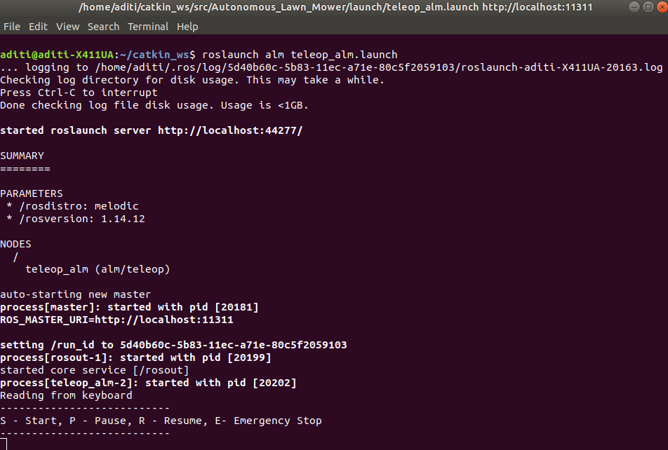

# Autonomous Lawn Mower - ALM
[](https://app.travis-ci.com/llDev-Rootll/Autonomous_Lawn_Mower)
[](https://coveralls.io/github/llDev-Rootll/Autonomous_Lawn_Mower?branch=master)
[](https://opensource.org/licenses/MIT)

A ROS based robot for autonomous lawn mowing.

## Authors

 - [Arunava Basu](https://www.linkedin.com/in/abasu713/) 
 - [Aditi Ramadwar](https://www.linkedin.com/in/aditiramadwar/) 

## Introduction
With the sprawl of the urbanized communities, today's houses have large lawns that demand constant upkeep. Such a manual an repetitive task is not only laborious but also taxing and truly unnecessary. Robot are great at performing complex repetitive tasks autonomously, and as this this is a great problem that can be solved using autonomous systems.
We propose to implement a robust robotic system in Gazebo and ROS inspired by an autonomous lawn mower called “Automower” which is capable of mowing a desired lawn area, following a predefined pattern to cut the lawn and dynamically avoid obstacles. This product would serve a long term project for ACME's robotics division and would be an ideal way to utilize the recent capital infusion in the department. Assuming an environment map known beforehand, our robot uses the TurtleBot robot as its base platform as it follows its trajectory for mowing the lawn. 

Our system is built using C++ and will leverage the ROS Navigation stack for performing autonomous navigation.


## Project Collaterals
The Agile Iterative Process will be used for the development of this system consisting of two sprints.

1. The project proposal can be found [here](https://github.com/llDev-Rootll/Autonomous_Lawn_Mower/blob/master/assets/Autonomous_Lawn_Mower-Proposal.pdf).
2. The quad chart can be found [here](https://github.com/llDev-Rootll/Autonomous_Lawn_Mower/blob/master/assets/Quad_Chart.pdf).
3. The overall backlog table and the tables for each sprints can be found [here](https://docs.google.com/spreadsheets/d/1cmejfr571rCQcNI3y2g41rq-KDfKz_WwcTCoZqvluJA/edit?usp=sharing).
4. The sprint planning notes can be found [here](https://docs.google.com/document/d/1wy9xlAPdjao29AV2lVo_EQJV9MCoEYegYT7aFkh7owY/edit).
5. The technical presentation slides can be found [here](https://docs.google.com/presentation/d/1gZXX1ICoL5XFpE4DEvGhv8NeWR12lm7TbL0wqJqIlRo/edit?usp=sharing)
6. The demo video of the package is linked [here]()

## System Architecture 
The following shows the activity diagram for our proposed schema : 


*Fig 1 :  Activity Diagram*

The corresponding class diagram can be found [here](https://github.com/llDev-Rootll/Autonomous_Lawn_Mower/blob/master/UML/Revised/Revised_Class_Diagram.pdf).
## Dependencies
- ROS Melodic : installation instructions [here](http://wiki.ros.org/melodic/Installation/Ubuntu)
- Ubuntu 18.04
- C++ Version 14+
- cmake minimum version 3.0.2
- turtlebot3 packages
### Steps to install dependencies
Run the following commands to install the dependencies required:
1. Installing the ROS navigation stack:
```
    sudo apt-get install ros-melodic-navigation
```
2. Installing the turtlebot3 dependencies:
```
    sudo apt-get install ros-melodic-turtlebot3 ros-melodic-turtlebot3-msgs ros-melodic-turtlebot3-navigation ros-melodic-turtlebot3-simulations 
```
## Install the ALM package

  Make a catkin workspace catkin_ws and run the following commands :
  
    cd <path_to_ws>/catkin_ws/src
    git clone https://github.com/aditiramadwar/Autonomous_Lawn_Mower.git
    cd ../
    catkin_make
## Steps to run the simulation using the launch file
1. In one terminal run :
```
source devel/setup.bash
roslaunch alm spawn.launch 
```
This spawns the turtlebot3 simulation in the custom world environment on the green lawn.


*Fig 2 : Spawn the robot in the world*

2. In a second terminal run the following to bring up the mowing routine node:
```
source devel/setup.bash
roslaunch alm mower.launch
```
This executes the lawn mowing simulation and bring up rviz for visualization of the different parameters.

3. In a third terminal run the following to start up the UI Node on the terminal:
```
source devel/setup.bash
roslaunch alm teleop_alm.launch
```


*Fig 3 : RVIZ visualisation*
### User Interface commands to control the robot
1. Press 's' key to start the entire trajectory tracking
2. Press 'p' key to pause the robot after it reaches the next desired trajectory point.
3. Press 'r' key to resume the trajectory tracking from the point where it was paused.
4. Press 'e' key to stop the robot immediately in case of a critical issue.



*Fig 4: Launch the User Interface to control the robot*
### Rosbag functionality
By default the rosbag recording is _disabled_, to enable the recording, run this:

    roslaunch alm mower.launch record:=true
Inspecting the recorded rosbag file: stop the launch file and run this,
```
rosbag info results/ros_bag_pub_sub.bag
```

## Unit Testing
Unit Testing is used to test each submodule and ensure complete code coverage. For this Google test (gtest) has been leveraged and identical test classes and methods are created with minimal modification in order to facilitate testing. 
To run the test cases, terminate the above three processes and run the following in a new terminal:

    catkin_make tests
    catkin_make test
or

    roslaunch alm test.launch

## Running cpplint & cppcheck tests
Run the following command in the root directory to generate cpplint results in **results** folder
 
    sh run_cpplint.sh
Run the following command in the root directory to generate cppcheck results in **results** folder

    sh run_cppcheck.sh
## Phase 1

 - Final Proposal has been updated with the suggestion made from the last phase
 - The github repo, travi-ci, and coveralls has been linked.
 - Quad chart, UMLs, Backlog Tables, and Sprint Planning sheet has been added.

 Please refer to the backlog table, [here](https://docs.google.com/spreadsheets/d/1cmejfr571rCQcNI3y2g41rq-KDfKz_WwcTCoZqvluJA/edit#gid=241005242), for an exhaustive list of tasks completed in Phase 1.
## Phase 2

 - The ROS package for autonomous lawn mowing was created
 - The class structures were defined
 - A new world to simulate our algoritm was created and mapped
 - Major functions for waypoint navigation have been implemented
 - A mock L shaped trajectory has been approximated for navigation
 - UMLs have been revised
 - Unit test case to check the quaternion conversion has been written
 - Launch files to spawn the simulation, run the lawn mowing node and the unit tests have been written
 
 Please refer to the backlog table, [here](https://docs.google.com/spreadsheets/d/1cmejfr571rCQcNI3y2g41rq-KDfKz_WwcTCoZqvluJA/edit#gid=1503816755), for an exhaustive list of tasks completed in Phase 2.

## Phase 3
- Methods for trajectory tracking verification were developed.
- Methods for functionality of robot to come back to initial position after trajectory tracking were implemented.
- UI interface was developed and was integrated with the main functionality of the robot.
- Final trajectory was developed for the navigation of robot on the lawn.
- Designed the unit test structure of each class and developed unit testing for functionalities.
- UMLs were revised according to the appropriate changes made.
 
Please refer to the backlog table, [here](https://docs.google.com/spreadsheets/d/1cmejfr571rCQcNI3y2g41rq-KDfKz_WwcTCoZqvluJA/edit#gid=1285958998), for an exhaustive list of tasks completed in Phase 3.
